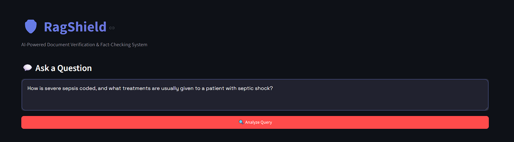

# RagShield

**A RAG app that checks every sentence of its own answers against the passages it retrieved, and shows you which ones the sources actually support.**

RagShield answers questions over your PDFs with retrieval + an LLM (Groq), then runs a local NLI cross-encoder over each generated sentence and underlines it:

| Underline | Meaning | Measured on RAGTruth QA (test) |
|---|---|---|
| 🟢 **Verified** | a retrieved passage entails the sentence | 1.5% of green sentences are unsupported |
| 🟡 **Not verified** | no passage establishes it | 8.0% unsupported |
| 🟠 **Low support - check it** | support is far weaker than usual | 21.4% unsupported |

The point of the project is the verification layer, and every number in this README comes from a benchmark in this repo that you can rerun (see [Reproducing the numbers](#reproducing-the-numbers)).



---

## How it works

```
PDF / TXT ─► chunk (600 chars) ─► ChromaDB ─► top-3 chunks ─► Groq (gpt-oss-20b) ─► answer
                                                   │                                  │
                                                   └────────────► NLI checker ◄───────┘
                                          each sentence × each chunk, keep the best-supporting chunk
```

1. **Retrieve.** The question is embedded (all-MiniLM-L6-v2) and the 3 nearest chunks come back from ChromaDB.
2. **Generate.** Groq's `openai/gpt-oss-20b` answers from those chunks, in plain prose.
3. **Split.** spaCy (`en_core_web_sm`) splits the answer into sentences.
4. **Check.** `cross-encoder/nli-deberta-v3-small` scores every (chunk, sentence) pair in one batched pass. **Each chunk is its own premise**, and the chunk with the highest P(entailment) decides the verdict and is shown as the evidence.
5. **Colour.** One number, that winning P(entailment), sets the underline: green at ≥ 0.85, orange below 0.000552, yellow in between.

Two design choices carry most of the accuracy, and both were measured:

- **Per-chunk scoring, not one concatenated premise.** NLI cross-encoders are trained on single premise-hypothesis pairs. Scoring against all chunks glued together dropped sentence AUROC on RAGTruth QA from 0.727 to 0.656 (answer AUROC 0.739 → 0.661), and truncated 68% of Summary pairs.
- **The label order is read from the checkpoint.** DeBERTa NLI checkpoints order their outputs differently from RoBERTa-MNLI. An earlier version of this project hardcoded the wrong order, which reported unsupported sentences as verified. The checker now reads `id2label` and refuses a checkpoint that does not name all three labels.

**Why there is no red "contradicted" underline.** It used to exist. On RAGTruth QA, sentences the model called contradicted were unsupported 7.7% of the time, against a 6.7% base rate, at every confidence gate up to 0.99. A red underline claiming "the source refutes this" was wrong about 92% of the time, so it was removed.

**Where the orange threshold comes from.** It is derived, not hand-picked: the largest cutoff that flags at most 5% of *supported* sentences on RAGTruth's **train** split. On the test split it flags 4.2% of supported sentences and catches 16% of unsupported ones. Most orange sentences (79%) are still supported, which is why it says "check it" and never "hallucinated". It sits so low because the model rarely entails paraphrased answers: P(entailment) ranks sentences well but is badly calibrated as a probability (ECE 0.56).

---

## Results

All results use `cross-encoder/nli-deberta-v3-small` (~142M parameters, running locally) with the settings in [`config.yaml`](config.yaml). Brackets are 95% bootstrap confidence intervals, resampling whole responses (sentences from one answer are not independent).

### 1. RAGTruth QA - does it detect hallucinated answers?

RAGTruth (Niu et al., ACL 2024) is a human-annotated benchmark of LLM responses with hallucination spans. The QA task (MS MARCO passages, 900 test responses) is the closest to what RagShield does, and the only one directly comparable to published results. An answer counts as flagged if **any** of its sentences is orange.

| | Answer-level F1 | Notes |
|---|---:|---|
| **RagShield** (local 142M NLI, no fine-tuning) | **41.9** [35.0, 48.4] | P 38.3, R 46.2; answer AUROC **0.739** [0.700, 0.777] |
| Flag every answer as hallucinated | 30.2 | the floor any detector must beat |
| Best possible cutoff chosen on the test set | 44.6 | a ceiling for this scorer, not a result |
| GPT-4 prompting | 63.4 | published |
| Luna (encoder-based) | 65.4 | published |
| Fine-tuned Llama-2-13B (RAGTruth paper) | 78.7 | published |
| LettuceDetect-large | 79.2 | published |
| Fine-tuned Llama-3-8B (RAG-HAT) | 83.9 | published |

Sentence level: AUROC **0.727** [0.694, 0.762] pooled, **0.692** within a response (159 responses with both kinds of sentence). The two are close, so the checker is genuinely ranking sentences inside an answer, not just telling easy responses from hard ones.

**Reading this honestly.** An off-the-shelf NLI model beats flagging everything by 11.7 F1 and gets within 2.7 of the best cutoff it could have, but it is well short of GPT-4 prompting and far from fine-tuned detectors. Its strength is the green underline: **98.5% of green sentences are supported**. It is a trust signal for what *is* backed by the sources, more than a hallucination detector.

Other RAGTruth tasks, reported for completeness: Summary sentence AUROC 0.697; Data2txt is at chance (0.544), because a JSON record cut into 600-character chunks is not a premise an NLI model can use. For those tasks the benchmark context is chunked the way the app chunks documents, unlike the published baselines, so only QA is comparable.

### 2. The app's own demo PDFs

60 questions over the two bundled documents (the *Attention Is All You Need* paper and the ICD-10-CM coding guidelines), run through the full pipeline: retrieval, Groq, then the checker. 161 answer sentences were labelled against the chunks retrieved for them.

> **These labels were written by Claude (an AI assistant), not by a human annotator.** They were written blind to the checker's scores and frozen before scoring (the label files' SHA-256 is recorded). They are committed in [`eval/data/indomain/`](eval/data/indomain/), with a rationale per sentence, so you can audit them. 48 of the 161 are marked borderline.

| | Demo PDFs | RAGTruth QA |
|---|---:|---:|
| unsupported share of 🟢 green sentences | 7.3% [0.0, 15.4] (n 41) | 1.5% |
| unsupported share of 🟡 yellow sentences | 27.3% [17.0, 38.7] (n 99) | 8.0% |
| unsupported sentences **not** shown green | 90.3% [76.0, 100] | - |
| sentence AUROC | 0.688 [0.583, 0.768] | 0.727 |
| … excluding borderline labels | 0.820 [0.734, 0.904] | - |

What this set shows that RAGTruth cannot:

- **Orange almost never appears on these answers**: 2 of 142 sentences. The threshold derived on RAGTruth sits below nearly everything this generator writes over these PDFs. **On your own documents, treat "not green" as the signal**, not orange.
- **All three unsupported sentences that turned green are borderline logic errors** (a wrong "only", a rule presented as its own exception). With borderline labels excluded, no green sentence was unsupported (0 of 27).
- **Retrieval causes most hallucinations.** When the retrieved chunks lacked the answer, 61% of answer sentences were unsupported, against 10% when they contained it.
- **Edited-to-be-wrong sentences** (56 supported sentences with a number, entity or negation changed): 89% lost their green underline, but only 12.5% turned orange, and a changed number never did. The six that stayed green each kept wording that also appears in the chunk (a code, a word like "discharge", a reversed order).
- **"I don't know" sentences** (19) all came out yellow, which is the honest reading.

### 3. Latency - what the checker adds

Live queries through Groq's free tier, measured on an RTX 3060 Laptop GPU and on the same machine's 16-thread CPU with the GPU hidden. Each of 20 questions was asked of plain Groq and through RAG, in random order, and the RAG answer was then checked.

| | GPU p50 / p95 | CPU p50 / p95 |
|---|---:|---:|
| Plain Groq, question only | 1.15 s / 3.06 s | 1.17 s / 3.25 s |
| RAG: retrieve + Groq with 3 chunks | 0.99 s / 1.23 s | 0.96 s / 1.68 s |
| **RagShield: RAG + checker** | **1.24 s / 1.53 s** | **1.25 s / 2.34 s** |
| **added by the checker** | **239 ms / 363 ms** | **264 ms / 986 ms** |
| cold start to the first checked answer | 33.0 s | 31.4 s |
| … of which loading the checker | 9.9 s | 9.1 s |

- **The checker adds ~0.24 s per answer on this GPU (19% of the wait).** On CPU it grows with answer length, at ~75 ms per sentence-chunk pair, so a 7-sentence answer spends about 1.6 s being checked.
- **Retrieval itself takes ~10 ms.** RAG answers were *faster* than plain Groq because, given passages, the model writes about a third as many tokens. Plain-vs-RAG timing mostly measures answer length.
- **Start-up is ~32 s**, almost all model loading. Streamlit caches the models, so it is paid once per server start. A fresh clone's first query adds ~12 s to embed the demo PDFs.
- On this laptop GPU the checker runs ~6× slower after a few seconds idle (65 ms back-to-back vs 391 ms after 9 s idle, for the same answer). The live numbers above include that.

### Limitations

- **One NLI model, no fine-tuning.** Fine-tuned detectors do far better on RAGTruth; this project measures what an off-the-shelf model gives you.
- **Per-chunk scoring cannot verify a sentence that combines facts from two chunks.** Of 14 such sentences in the demo set, 11 were shown yellow.
- **Logic errors can still turn green.** A sentence that reuses the source's words with a changed rule ("added to the sequela code, not the injury code") can be entailed.
- **The orange threshold was derived on RAGTruth** and rarely fires on the demo PDFs. It was deliberately not re-fitted on 31 unsupported demo sentences.
- **Small in-domain set, AI-written labels.** 60 answers, one annotator. The intervals above are wide for that reason.
- **Latency is one machine and Groq's free tier** (8,000 tokens/minute, roughly 7 queries a minute). The app does not retry when Groq rate-limits.
- **English only**, and sentence splitting merges some list items, so one underline can cover two claims.

---

## Setup

Requires Python 3.10 and a free [Groq API key](https://console.groq.com/).

```bash
git clone https://github.com/te4bag/rag-shield.git
cd rag-shield
pip install -r requirements.txt
# create a file named .env containing:  GROQ_API_KEY=your_key_here
streamlit run app.py        # http://localhost:8501
```

`requirements.txt` is fully pinned, including the spaCy model, because sentence splitting decides what gets checked. It installs the CPU build of PyTorch. For a GPU, install `torch==2.10.0` from `https://download.pytorch.org/whl/cu128` instead; verdicts are identical, only latency changes. Model weights (~700 MB) download on first run into the Hugging Face cache (`HF_HOME`).

The demo PDFs live in `demo/example_docs/`. Upload your own PDF or TXT files from the sidebar; only new or changed documents are re-embedded.

### Using it from Python

```python
from ingest import DocumentLoader
from index import RagShieldIndex
from rag import Retriever, RagGenerator
from verify import NLIAuditor

index = RagShieldIndex()
index.sync_documents(DocumentLoader("demo/example_docs").load())

question = "How should a confirmed diagnosis of COVID-19 be coded?"
chunks = Retriever(index=index).retrieve(question)
answer = RagGenerator().generate_answer(question, "\n\n".join(c["text"] for c in chunks))

for r in NLIAuditor().audit_response(answer, chunks):
    print(f"{r['verdict']:<12} P(entailment)={r['entailment']:.3g}  {r['evidence']['chunk_id']}  {r['sentence']}")
```

Each result is `{sentence, verdict, entailment, probabilities, evidence}`, where `verdict` is `ENTAILMENT`, `NEUTRAL` or `LOW_SUPPORT` and `evidence` names the chunk that decided it.

### Configuration

Everything tunable is in [`config.yaml`](config.yaml):

```yaml
ingestion:
  chunk_size: 600
  chunk_overlap: 60
retrieval:
  top_k: 3
models:
  embeddings: "all-MiniLM-L6-v2"
  generator: "openai/gpt-oss-20b"
  nli_model: "cross-encoder/nli-deberta-v3-small"
verification:
  entailment_threshold: 0.85        # green
  low_support_threshold: 0.000552   # orange; derived, see above. 0.0 disables orange
  aggregation: "max_entailment"     # per-chunk scoring
  batch_size: 32
  max_length: 512
```

If you change the NLI model, chunking or sentence splitting, re-derive `low_support_threshold` (below); it is only valid for the setup it was measured on.

---

## Reproducing the numbers

The test suite (`pip install -r requirements-dev.txt && pytest`, ~13 s) is offline: no model weights, no network.

The benchmarks need the models and, for RAGTruth, a one-time download. Times are on an RTX 3060 Laptop GPU.

```bash
# RAGTruth: download (pinned revision) and map span labels onto the app's sentences (~12 min)
python -m eval.datasets ragtruth build

# Section 1: score the test split with per-chunk and concatenated premises (~30 min), then report
python -m eval.run score --split test --name e3-test-full
python -m eval.run report eval/results/e3-test-full --tau 0.000552

# The orange threshold: score train QA (~15 min), derive on train, report on test
python -m eval.run score --split train --task-types QA --aggregations max_entailment --name e4-train-qa
python -m eval.calibrate --train eval/results/e4-train-qa --test eval/results/e3-test-full

# Section 2: the committed in-domain set (~5 s)
python -m eval.indomain score

# Section 3: latency, GPU and CPU (~10 min each, makes live Groq calls)
python -m eval.latency run --device auto --name gpu
python -m eval.latency run --device cpu --name cpu
```

Results land in `eval/results/` (not committed). Every report prints the label-file SHA-256, the git commit and the device, so a rerun can be checked against these numbers. RAGTruth scoring is byte-reproducible on the same machine; live Groq latency is not.

**Dataset.** RAGTruth: Niu et al., *RAGTruth: A Hallucination Corpus for Developing Trustworthy Retrieval-Augmented Language Models*, ACL 2024. Used via the Hugging Face copy [`wandb/RAGTruth-processed`](https://huggingface.co/datasets/wandb/RAGTruth-processed) at revision `eb4f4b9d1b68eb7092d3e1a61c0cd82d9808737b`. The derived sentence labels are generated locally and not redistributed here.

---

## Repository structure

```
rag-shield/
├── app.py                 # Streamlit app
├── config.yaml            # all tunables
├── ingest/                # PDF / TXT extraction
├── index/                 # chunking, ChromaDB index with incremental sync, config loader
├── rag/                   # retrieval and Groq generation
├── verify/                # sentence splitting and the NLI checker
├── ui/                    # verdict colours, labels and HTML (kept out of app.py so it is testable)
├── eval/
│   ├── metrics.py         # AUROC (pooled and within-response), calibration, bootstrap CIs
│   ├── run.py             # RAGTruth benchmark runner
│   ├── calibrate.py       # derives the orange threshold on train
│   ├── indomain.py        # scores the demo-PDF set
│   ├── latency.py         # latency benchmark
│   ├── datasets/          # RAGTruth label builder, in-domain set tools
│   └── data/indomain/     # questions, answers, labels and perturbations (committed)
├── demo/example_docs/     # the two demo PDFs
└── tests/                 # offline test suite
```

---

## A note on earlier versions of this README

Earlier versions reported a detection rate of 94.2%, a 3.1% false-positive rate, 1.2 s per query and 97.8% attribution accuracy on "500 medical coding queries". **No benchmark behind those figures existed, and they have been withdrawn.** The worked examples in those versions were also produced while the checker read the model's labels in the wrong order, so their green verdicts were not real entailments. Everything above replaces them with measured results.
